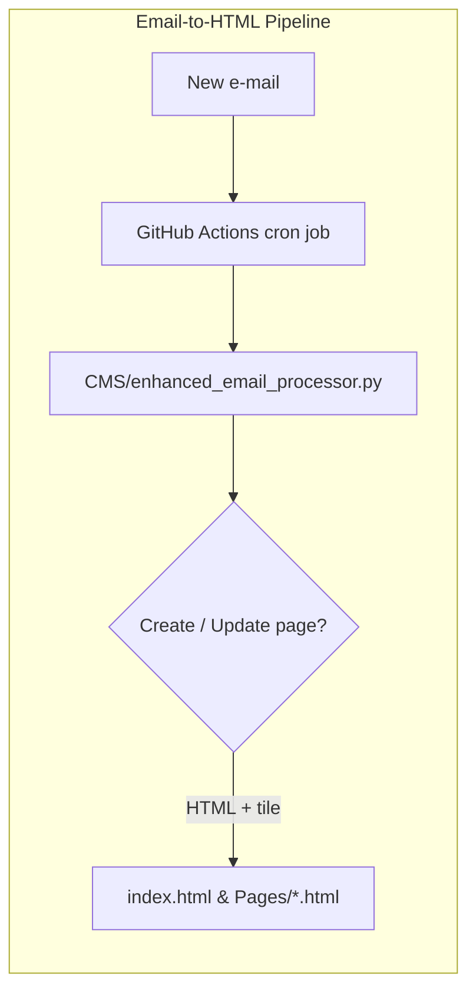

# Cody Yohn – Portfolio Website

[](https://github.com/cyohn55/Portfolio/actions/workflows/tests.yml)

A **static portfolio site** hosted on **GitHub Pages** and powered by a lightweight **Email-to-CMS** pipeline.  Send an e-mail → a GitHub Action turns it into a new HTML page → your site updates automatically – no manual deploys necessary.

---

## ✨ Key Highlights

* **Zero-friction publishing** – author content from any mail client.
* **Fully serverless** – GitHub Actions handles scheduling & compute.
* **Responsive design** – one stylesheet (`style.css`) provides desktop ↔ mobile layouts.
* **Automated tests** – every push & PR runs `pytest` via the *tests* workflow badge above.

---

## 🗂️ Repository Tour

| Path | What lives here |
|------|-----------------|
| `index.html`, `Pages/`, `images/`, `style.css`, `script.js` | Static assets served by GitHub Pages |
| `CMS/` | Python package that fetches e-mails, parses Markdown, saves attachments, commits generated pages, and updates navigation tiles |
| `.github/workflows/` | CI definitions – `tests.yml` runs the unit-test suite |
| `test_*.py` | Pytest test-cases for the CMS helpers |



---

## 🛠️ Local Development

1. Create & activate a virtualenv (optional but recommended)

```bash
python -m venv .venv
source .venv/bin/activate  # Windows: .venv\Scripts\Activate
```

2. Install dependencies (pinned versions):

```bash
pip install -r CMS/requirements.txt
```

3. Run the test-suite:

```bash
pytest -q
```

---

## 🚀 Production Workflow

1. A cron-triggered GitHub Actions workflow (every 5 minutes) connects to the Gmail inbox.
2. For each unseen e-mail from the authorised sender, the CMS:
   * downloads attachments
   * converts Markdown body → HTML via **`markdown` 3.5**
   * updates `index.html` with a new project tile
   * commits & pushes the changes back to `main`
3. GitHub Pages deploys the new commit – your site is live within seconds.

---

## 📸 Preview


---

## License

MIT © Cody Yohn
